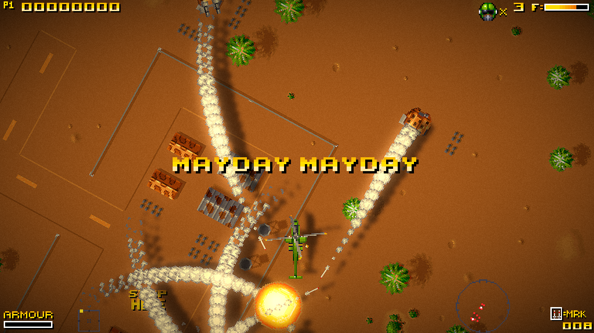
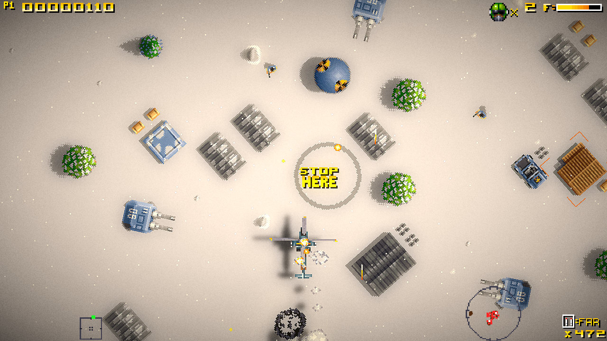
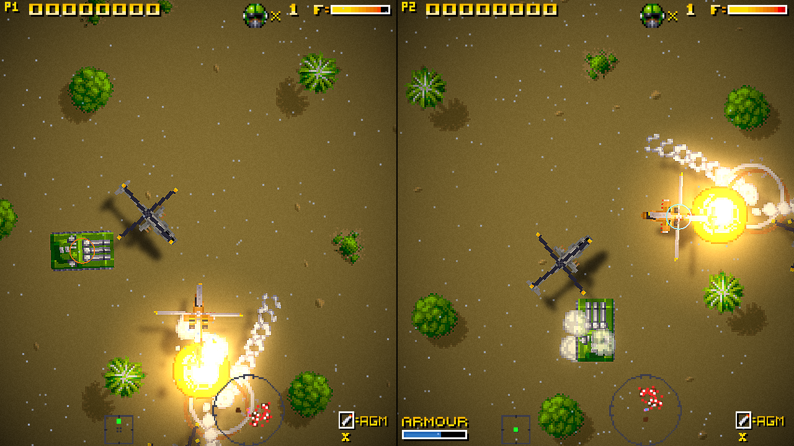
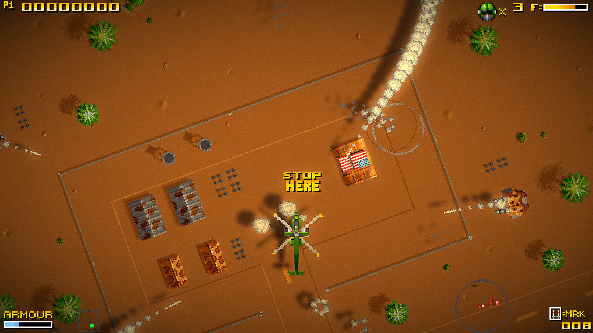

# About openSEEK game

openSEEK is an open-source recreation of the game Seek & Destroy originally developed by SAFARI Software and Vision. It aims to provide a modern and accessible version of the game, while using the original game's assets and mechanics as a foundation.

The engine is built using Lua and the Love2D framework and it's not a direct copy of the original game, but rather a reimagined version that captures the essence of Seek & Destroy while introducing new features and improvements. 

# Notable features of openSEEK include:
* support for arbitrary screen resolutions and aspect ratios
* customizable controls and input methods
* new visual effects
* in-game level editor for exploring original levels and creating new ones (in development)
* multiplayer support for cooperative and network gameplay (in development)
* many little but cute QoL improvements
* unlocks few new vehicles and weapons that were not present in the original game (in development)
* playable on Linux, Windows, and macOS. Also supports Android and web

> [!IMPORTANT]
> openSEEK does *not* provide any copyrighted assets. You must have your own copy of the original game.

# TL;DR, show me the game already!

 

    
     
    
     
    
     
    

